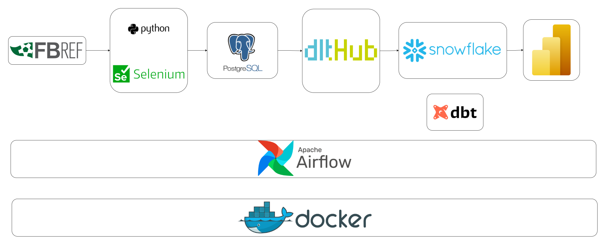
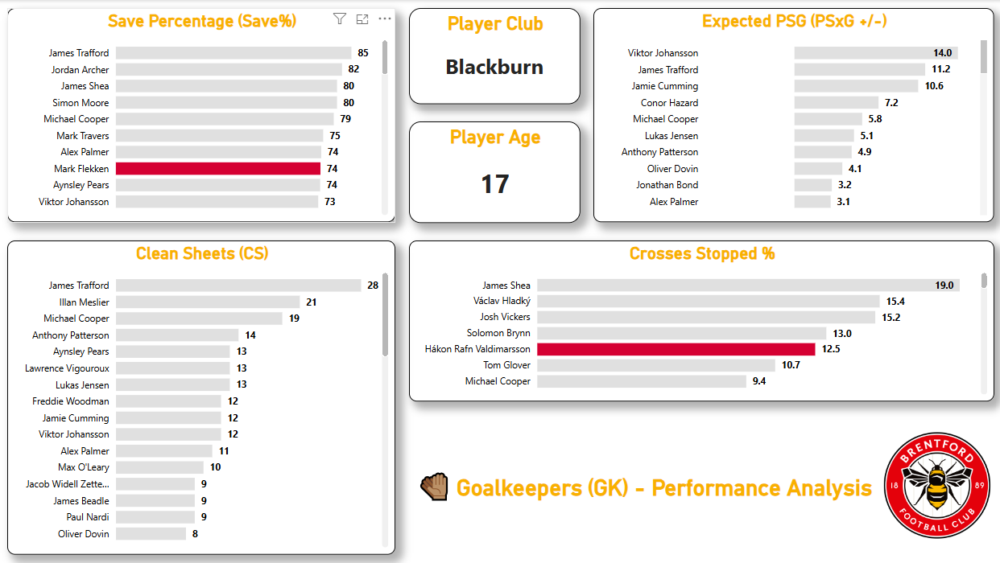
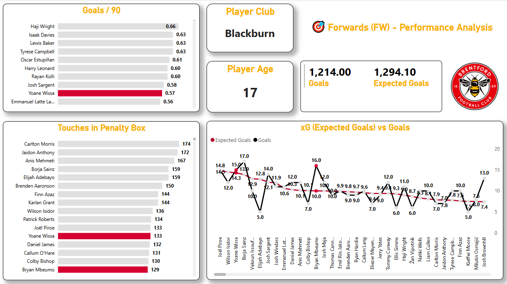
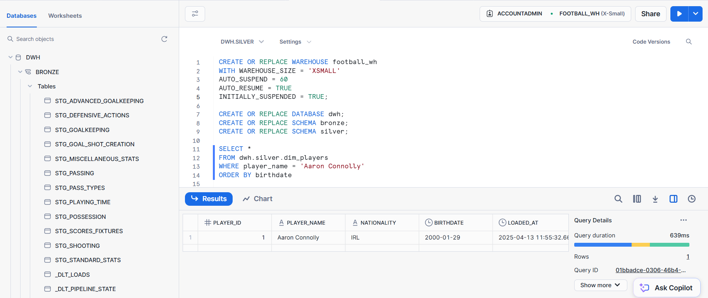
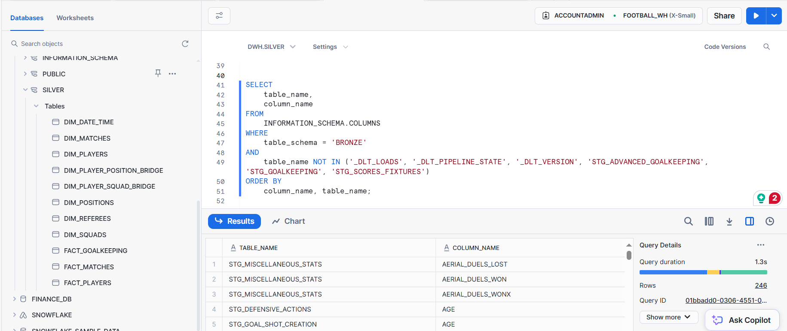

# ⚽ Brentford Data Analytics

A complete, end-to-end football analytics pipeline designed to analyze player and match performance for **Brentford FC** and other Championship clubs during the **2024–2025** season — using a modern data stack and cloud architecture.

---

## 📚 Table of Contents

- [📌 Project Overview](#-project-overview)
- [🚀 Tech Stack](#-tech-stack)
- [🗂️ Folder Structure](#️-folder-structure)
- [🔄 Architecture Overview](#-architecture-overview)
- [📈 Dashboards](#-dashboards)
- [🧰 How to Run the Project](#-how-to-run-the-project)

---

## 📌 Project Overview

This project scrapes detailed football statistics from [FBref](https://fbref.com/), stores them in a **PostgreSQL** database, and then transforms them into meaningful insights through a modern ELT pipeline using:

- **Selenium** to scrape data
- **PostgreSQL** as a landing database
- **dlt** for ingestion into Snowflake (Bronze layer)
- **dbt** for transformations (Bronze → Silver)
- **Apache Airflow** for orchestration
- **MS Power BI** for dashboards

---

# 🎯 Problem Statement & Solution

### 📌 The Problem
Football clubs, especially in competitive leagues in England, face increasing pressure to make data-driven decisions regarding recruitment, performance analysis, and match strategy. However, many clubs lack accessible and centralized platforms that collect, transform, and visualize comprehensive player and team data consistently and reliably.
This often leads to:
1. Fragmented data across multiple sources.
2. Manual reporting and analysis.
3. Missed insights in scouting and performance tracking.
4. Inefficiencies in the data pipeline and lack of automation.

### ✅ The Solution
The **Brentford Data Analytics** project solves these challenges by building a complete end-to-end modern data stack using open-source tools and cloud infrastructure.

With this architecture, **Brentford FC** (or any other club) can:
1. Compare players across the league using consistent metrics.
2. Evaluate team and player performance over time.
3. Automate workflows and focus on tactical and strategic decision-making.

---

## 🚀 Tech Stack

| Layer             | Tool/Technology        |
|-------------------|------------------------|
| **Scraping**      | Python, Selenium       |
| **Infrastructure**| Docker                 |
| **Landing DB**    | PostgreSQL             |
| **Ingestion**     | dlt                    |
| **Data Warehouse**| Snowflake              |
| **Modeling**      | dbt                    |
| **Orchestration** | Apache Airflow         |
| **BI Tool**       | MS Power BI            |

---

## 🗂️ Folder Structure

```
Brentford-Data-Analytics/
│
├── scripts/                    # Scraping & data loading
│   └── functions/
│       ├── __init__.py
│       ├── clean_data.py
│       └── scrape_data.py
│   └── scraper.py
│
├── etl_pipeline/              # dlt pipeline to Snowflake
│   ├── .dlt/
│   ├── etl_pipeline.py
│
├── airflow/                   # Airflow DAGs and config
│   ├── dags/
│   │   └── full_pipeline_dag.py
│   └── .env                   # DAG-specific env variables
│
├── snowflake_dbt/             # dbt models
│   ├── models/
│   │   ├── dim/
│   │   ├── fact/
│   └── dbt_project.yml
│
├── BI/                        # Power BI files
│   └── brentford_dashboard.pbix
|
├── images/                    # Screenshots files
│
├── docker-compose.yml         # Infrastructure setup
├── .gitignore
├── README.md
├── data_dictionary.md
└── architecture_diagram.png
```

---

## 🔄 Architecture Overview



---

## 📈 Dashboards

Dashboards are created using **MS Power BI** and connected to the **Silver layer** in Snowflake.

Key Insights Include:
- 🧍 Player Performance Overview  
- 🧤 Goalkeeper Metrics  

🔗 [View Live Dashboard on NovyPro](https://project.novypro.com/1EbxTO)





---

## 🔧 How to Run the Project

### 1. Clone the Repo

```bash
git clone https://github.com/your-username/Brentford-Data-Analytics.git
cd Brentford-Data-Analytics
```

### 2. Set Up Environment

```bash
cp .env.example .env
# Fill in PostgreSQL, Snowflake, and other variables
```

### 3. Start Infrastructure (Postgres, Airflow, etc.)

```bash
docker-compose up -d
```

### 4. Access Airflow UI

Go to: [http://localhost:8080](http://localhost:8080)  
Default credentials:
```
Username: airflow
Password: airflow
```

### 5. Trigger the Full Pipeline DAG

From the Airflow UI:
- Toggle the DAG switch "on"
- Click ▶️ to trigger the DAG named `full_pipeline_dag`

Or from CLI inside the container:

```bash
docker exec -it airflow-webserver bash
airflow dags trigger full_pipeline_dag
```

---

## 📁 DAGs Overview

- `full_pipeline_dag`: Orchestrates scraping → PostgreSQL → dlt → Snowflake → dbt
- `dlt_load_dag`: Isolated dlt run (optional trigger)

---

## 🧰 Notes

- All models follow the **Medallion architecture** (Bronze → Silver).
- Airflow runs each part of the pipeline in sequence.
- Power BI visuals use Brentford’s brand theme & color palette.
- All tables have `loaded_at` to track freshness.

---

🏁 *For detailed flows and table info, see:*  
- [`data_dictionary.md`](./data_dictionary.md)  





---

## 🤝 Contributions

This project is currently maintained for learning and demonstration purposes. If you'd like to contribute, feel free to fork and open a pull request!
